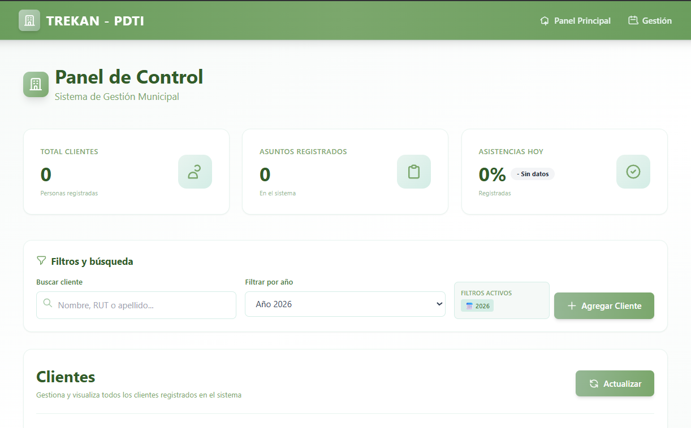

<p align="center">
  
  
  
</p>

<p align="center">
  
</p>

<h1 align="center">TREKAN - PDTI – Frontend</h1>

<p align="center">
Frontend desacoplado construido con Vue 3, diseñado para consumir una API REST externa.
</p>

---

## Descripción general

Este repositorio contiene el frontend de la aplicación, desarrollado como un proyecto
independiente y desacoplado del backend.  
La aplicación está construida con Vue 3 y Vite, siguiendo principios de separación de
responsabilidades y comunicación mediante API REST.

El objetivo principal de este repositorio es concentrar exclusivamente la lógica de
presentación, la experiencia de usuario y la interacción con servicios externos.

---

## Alcance del proyecto

### Incluye
- Renderizado de la interfaz de usuario
- Gestión de estado del lado del cliente
- Consumo de endpoints REST
- Validaciones en el cliente
- Manejo de respuestas y errores de la API

### No incluye
- Lógica de negocio
- Persistencia de datos
- Autenticación a nivel servidor
- Reglas de dominio

---

## Arquitectura

El proyecto sigue un enfoque de frontend desacoplado, donde la aplicación cliente
consume servicios expuestos por un backend independiente.

La comunicación se realiza mediante HTTP y endpoints REST, permitiendo:
- Desarrollo independiente entre frontend y backend
- Despliegue desacoplado
- Escalabilidad y mantenibilidad a largo plazo

---

## Tecnologías utilizadas

- Vue 3
- Vite
- JavaScript (ES6+)
- HTML5
- CSS
- npm

---

## Configuración del entorno

### Requisitos previos
- Node.js (versión LTS recomendada)
- npm

Las variables de entorno se gestionan mediante archivos `.env`,
los cuales no se incluyen en el repositorio por motivos de seguridad.

---

## Estructura del proyecto

```txt
src/
 ├─ components/   Componentes reutilizables
 ├─ pages/        Vistas principales
 ├─ services/     Comunicación con la API
 ├─ hooks/        Lógica reutilizable
 ├─ styles/       Estilos globales
 └─ main.js       Punto de entrada
```
Instalación
npm install
Ejecución en desarrollo
npm run dev

La aplicación estará disponible en el puerto configurado por Vite.

Build de producción
npm run build

Los archivos optimizados se generan en el directorio dist/.

Integración con backend

Este frontend está diseñado para consumir un backend ubicado en un repositorio separado.
La URL base del backend se define mediante variables de entorno.

Mientras se mantenga el contrato de la API, el backend puede cambiar sin requerir
modificaciones internas en el frontend.

Estándares y buenas prácticas

Separación clara entre vistas, componentes y servicios

Código modular y reutilizable

Convenciones de nombres consistentes

Evitar lógica de negocio en el cliente

Manejo explícito de errores provenientes de la API

Licencia

Este proyecto se distribuye bajo la licencia MIT.
